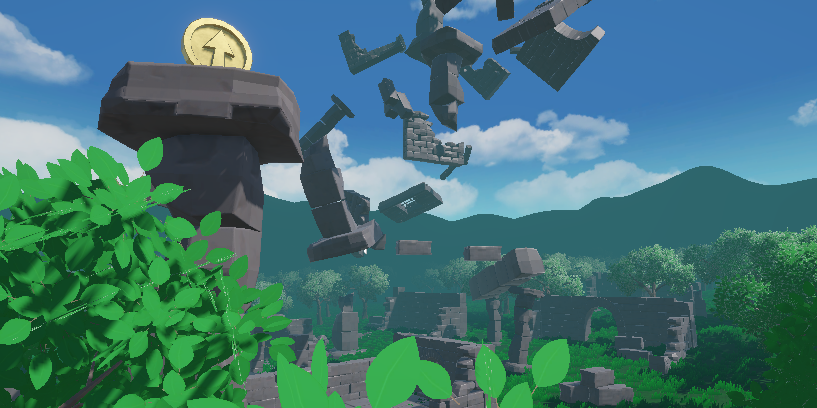
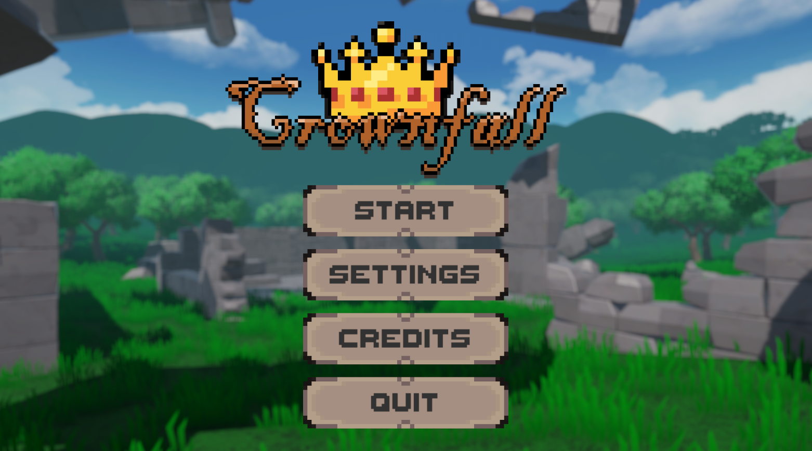
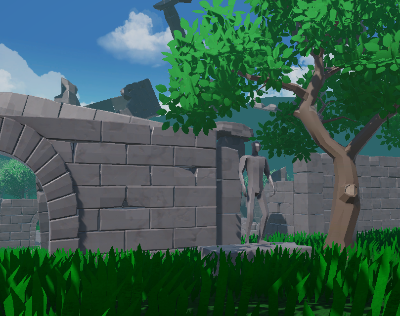
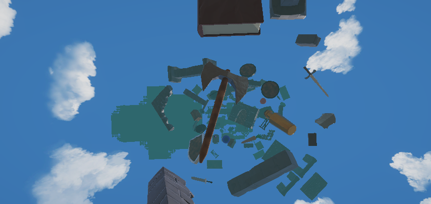
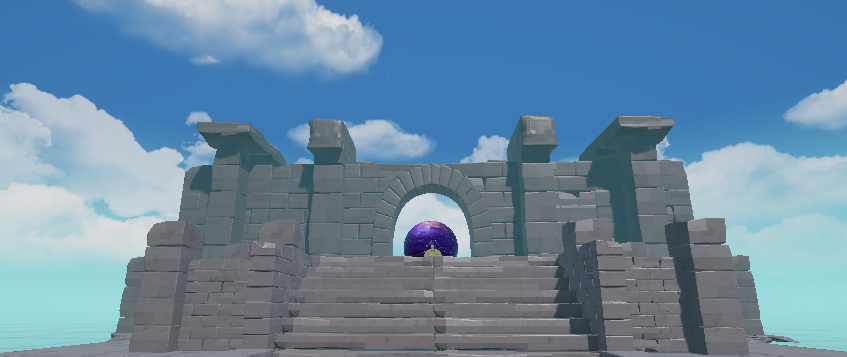
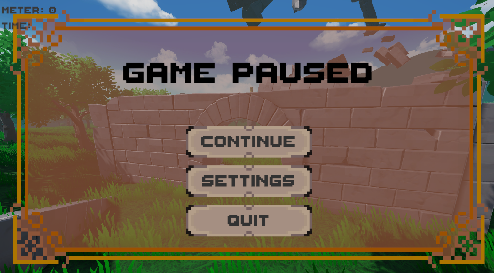

# CrownFall

# Overview

After a tragic accident, the kingdom’s magical energy core exploded.
The resulting blast shattered the realm and hurled its fragments into the sky, where they now remain suspended in time.

CrownFall was developed as a learning project within three weeks (June 17 - July 10).
It tells the symbolic story of a fallen king striving to reclaim what was lost — both his world and his strength.

# Gameplay Loop

+ Begin at the Main Menu.

+ Select a mission and learn the controls via the Settings menu.

+ Explore the floating remains of the kingdom.

+ Move carefully upward to reach the goal - there are no checkpoints.

+ Collect chests, carrots, and nine unique emblems as optional achievements.

+ Race against time using the built-in speedrun timer.

+ Discover small environmental secrets and Easter eggs along the way.

+ The goal is to reach the top as quickly and precisely as possible, balancing challenge and mastery in a risk-filled climb.

# Controls

+ WASD - Move
+ Mouse - Look around
+ Shift - Sprint
+ Space - Jump
+ E - Interact
+ I - Open emblem inventory
+ ESC - Pause
+ Left Mouse Button - Select in menus

# Features

+ Two interactive NPCs

+ Eleven collectible chests

+ Eighteen collectible carrots

+ Nine collectible emblems

+ Various ambient and event-based sounds

+ Integrated timer and distance counter

+ Hidden Easter eggs and environmental secrets

+ No checkpoints for added tension and replayability

+ Symbolic story about loss, perseverance, and rebuilding

+ Low-poly, stylized 3D world with pixel-art UI elements

# Used Tools

+ Unity 6.1
+ C#
+ Blender
+ Substance Painter
+ Photoshop 2025
+ Aseprite
+ DaVinci Resolve

# Known Issues

+ The player can climb walls angled below 90° by pressing W while shaking the mouse quickly.

+ Emblem inventory may display incorrect hovered items after reopening.

+ A short pause (~0.5s) can occur between ambient sound loops.

+ Some sound effects may play too loudly.

# Gallery

# Author

Developed and designed by Ben Zimmermann
# Try It

If you want to try the Game for yourself you can download it here:
(https://srhfachschulen.itch.io/crownfall)

# Credits

### Code Reference:

+ https://www.youtube.com/watch?v=vBWcb_0HF1c

### 3D Assets:

+ https://assetstore.unity.com/packages/3d/environments/lowpoly-environment-nature-free-medieval-fantasy-series-187052

+ Chest and NPC models by [Dennis De Col](https://github.com/Keradean)

### Fonts:

+ https://assetstore.unity.com/packages/2d/fonts/free-pixel-font-thaleah-140059

### Animations:

+ Idle and floating animations from Mixamo (https://www.mixamo.com)

### Audio:

+ Ambient sounds sourced and edited from various YouTube recordings

+ Music by Anastasia Chubarova from Pixabay

+ Sound effects by Universfield and freesound_community from Pixabay

---

If you copy this code, credit me - or I will haunt you in your dreams!
